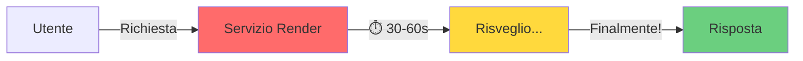
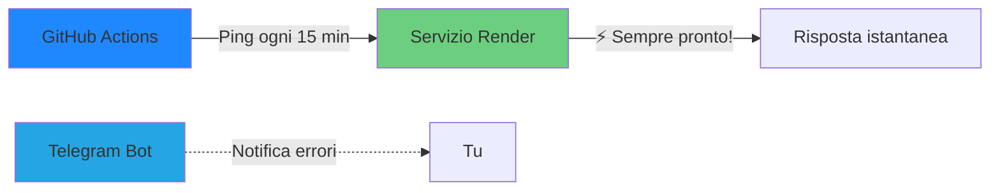

# 🚀 Render Keep-Alive System


**Sistema automatico per mantenere attivi i servizi Render con monitoraggio intelligente e notifiche in tempo reale**

[Caratteristiche](#-caratteristiche) • [Quick Start](#-quick-start) • [Documentazione](#-documentazione) • [FAQ](#-faq)

---

## 📖 Cos'è questo progetto?

I servizi gratuiti su **Render** vanno in standby dopo periodi di inattività, causando ritardi di 30-60 secondi alla prima richiesta. Questo sistema risolve il problema in modo elegante ed efficiente.

### 🎯 Il problema



### ✨ La soluzione



---

## ⚡ Caratteristiche

### 🤖 Automazione Completa
- ✅ Ping automatici ogni 15 minuti
- ✅ Attivo lun-sab, 07:30-22:15 (ora italiana)
- ✅ Zero manutenzione richiesta
- ✅ Keepalive automatico per GitHub Actions

### 📊 Monitoraggio Avanzato
- ✅ Log persistente su GitHub Gist
- ✅ Backup automatici (7 giorni)
- ✅ Storico delle ultime 500 esecuzioni
- ✅ Visualizzazione in tempo reale

### 🔔 Notifiche Intelligenti
- ✅ Telegram instant alert su errori
- ✅ Dettagli completi (codice HTTP, orario)
- ✅ Silenzioso quando tutto funziona
- ✅ Formato leggibile e informativo

### 💰 Zero Costi
- ✅ Usa solo risorse gratuite
- ✅ ~1.5% del limite GitHub Actions
- ✅ Storage trascurabile
- ✅ Efficiente e ottimizzato

---

## 🚀 Quick Start

### Prerequisiti

- Account GitHub (dove risiede questo repository)
- Account Telegram (per le notifiche)
- Servizio su Render da mantenere attivo

### Installazione in 5 minuti

#### 1️⃣ Crea un Bot Telegram

```bash
# Su Telegram, cerca @BotFather e invia:
/newbot

# Segui le istruzioni e salva il TOKEN
# Esempio: 123456789:ABCdefGHIjklMNOpqrsTUVwxyz
```

#### 2️⃣ Ottieni il tuo Chat ID

**Opzione A - Via browser:**
```bash
# Scrivi un messaggio al bot, poi visita (sostituisci <TOKEN>):
https://api.telegram.org/bot<TOKEN>/getUpdates

# Cerca "chat":{"id":123456789 nel JSON
```

**Opzione B - Via bot:**
```bash
# Su Telegram, cerca @userinfobot e invia:
/start
```

#### 3️⃣ Crea un Gist per i log

1. Vai su https://gist.github.com
2. Crea un **Secret Gist**:
   - Filename: `ping-log.txt`
   - Content: `# Log inizializzato`
3. Salva l'ID dall'URL: `gist.github.com/user/[QUESTO-È-IL-GIST-ID]`

#### 4️⃣ Configura i Secrets

Vai su **Settings** → **Secrets and variables** → **Actions** e crea:

| Secret | Valore | Esempio |
|--------|--------|---------|
| `GIST_ID` | ID del Gist | `a1b2c3d4e5f6g7h8` |
| `TELEGRAM_TOKEN` | Token del bot | `123456789:ABC...` |
| `TELEGRAM_CHAT_ID` | Tuo chat ID | `987654321` |

#### 5️⃣ Verifica

1. Vai su **Actions** → **Keep Render Awake**
2. Clicca **Run workflow**
3. Attendi 1-2 minuti
4. ✅ Dovresti vedere "Ping eseguito: 200"

---

## 📁 Struttura del Progetto

```
.
├── .github/
│   └── workflows/
│       ├── ping.yml          # Script principale di keep-alive
│       └── keepalive.yml     # Mantiene attivi i workflow GitHub
├── docs/
│   └── MANUAL.md            # Manuale dettagliato d'uso
└── README.md                # Questo file
```

---

## 🔧 Configurazione Avanzata

### Modificare la frequenza dei ping

```yaml
# File: .github/workflows/ping.yml

# Ogni 30 minuti (invece di 15)
schedule:
  - cron: '30 6-21 * * 1-6'

# Ogni 10 minuti (più frequente)
schedule:
  - cron: '*/10 6-21 * * 1-6'
```

### Aggiungere la domenica

```yaml
# Cambia 1-6 in 0-6 (0 = domenica)
- cron: '30,45 6 * * 0-6'
- cron: '0,15,30,45 7-20 * * 0-6'
- cron: '0,15 21 * * 0-6'
```

### Cambiare l'endpoint

```yaml
# Modifica questa riga nello step "Ping servizio Render"
SITE="https://tuo-servizio.onrender.com/tuo-endpoint/"
```

---

## 📊 Monitoring e Log

### Visualizzare lo storico completo

**🔹 GitHub Gist**

Storico permanente (500 righe)

```
2025-11-08 14:30:00 | HTTP 200
2025-11-08 14:45:00 | HTTP 200
2025-11-08 15:00:00 | HTTP 500
```

[Vai al tuo Gist →](https://gist.github.com)

**🔹 GitHub Actions**

Log dettagliati (90 giorni)

```
✅ Ping eseguito: 200
✅ Log caricato su Gist
```

[Vai ad Actions →](../../actions)

**🔹 Artifacts**

Download backup (7 giorni)

```
📦 ping-log-backup.zip
   └── log.txt
```

[Scarica artifacts →](../../actions)

### Dashboard delle notifiche

Le notifiche Telegram mostrano:

```
⚠️ Ping fallito

Servizio: `otello-web.onrender.com`
Codice HTTP: `500`
Orario: 2025-11-08 15:00:00
```

**Codici HTTP comuni:**
- `200` = ✅ Tutto OK
- `500` = ❌ Errore server
- `503` = ⚠️ Servizio non disponibile
- `TIMEOUT` = ⏱️ Nessuna risposta (>10s)

---

## 🛡️ Sicurezza e Privacy

### ✅ Best Practices Implementate

- 🔐 Secrets crittografati su GitHub
- 🔒 Gist privato (non pubblico)
- 🚫 Nessun dato sensibile nei log
- ⏱️ Timeout di sicurezza (3 minuti)
- 🔄 Gestione errori robusta

### ⚠️ Considerazioni

| Aspetto | Dettaglio |
|---------|-----------|
| **Repo pubblica** | L'URL del servizio è visibile nel codice |
| **Chat ID** | Potrebbe apparire nei log pubblici (non critico) |
| **Rate limiting** | Render potrebbe bloccare ping troppo frequenti |

### 🔒 Raccomandazioni

1. ✅ Non commitare mai secrets nel codice
2. ✅ Usa sempre GitHub Secrets
3. ✅ Rigenera i token se compromessi
4. ✅ Mantieni il Gist privato

---

## 📈 Performance e Costi

### Risorse Utilizzate

```
┌─────────────────────────────────────────┐
│  GitHub Actions Minutes (mensile)       │
├─────────────────────────────────────────┤
│  Esecuzioni: ~1.800/mese                │
│  Durata: ~30s/esecuzione                │
│  Totale: ~900 min = ~15 ore             │
│  Limite Free: 2.000 min/mese            │
│  Utilizzo: 45% ✅                        │
└─────────────────────────────────────────┘

┌─────────────────────────────────────────┐
│  Storage                                │
├─────────────────────────────────────────┤
│  Gist log: ~30 KB                       │
│  Artifacts (7gg): ~7 KB                 │
│  Totale: ~37 KB (trascurabile)          │
└─────────────────────────────────────────┘
```

### Ottimizzazioni Implementate

- ⚡ Log limitato a 500 righe (previene crescita infinita)
- ⚡ Artifacts con retention 7 giorni (risparmia storage)
- ⚡ Timeout aggressivo (evita esecuzioni bloccate)
- ⚡ `continue-on-error` strategico (resilienza)

---

## 🐛 Troubleshooting

<details>
<summary><b>❌ Il workflow non parte automaticamente</b></summary>

**Causa:** GitHub Actions potrebbe essere disabilitato.

**Soluzione:**
1. Settings → Actions → General
2. Abilita "Allow all actions and reusable workflows"
3. Verifica che il workflow non sia in stato "disabled"

</details>

<details>
<summary><b>📵 Non ricevo notifiche Telegram</b></summary>

**Possibili cause:**
- Token/Chat ID errati → Verifica i secrets
- Bot non avviato → Scrivi `/start` al bot
- Ping funziona (HTTP 200) → Le notifiche arrivano solo in caso di errore

**Test rapido:**
```bash
# Modifica temporaneamente l'URL con uno errato per forzare un errore
SITE="https://url-inesistente.com"
```

</details>

<details>
<summary><b>📝 Il log non si aggiorna sul Gist</b></summary>

**Checklist:**
- [ ] `GIST_ID` corretto nei secrets
- [ ] Il Gist esiste ed è tuo (non di altri)
- [ ] Hai permessi di scrittura sul Gist

**Reset:**
1. Crea un nuovo Gist
2. Aggiorna il secret `GIST_ID`
3. Esegui un test manuale

</details>

<details>
<summary><b>⏱️ Timeout del workflow</b></summary>

**Errore:** `has exceeded the maximum execution time of 3 minutes`

**Soluzione:** Aumenta il timeout in `ping.yml`:
```yaml
timeout-minutes: 5  # Era 3
```

</details>

<details>
<summary><b>🔧 Errore "Invalid workflow file"</b></summary>

**Causa:** Sintassi YAML errata.

**Soluzione:**
1. Copia nuovamente il file dalla repo
2. Verifica con https://www.yamllint.com/
3. Assicurati di usare spazi (non tab)

</details>

---

## 📚 Documentazione

| Documento | Descrizione |
|-----------|-------------|
| [MANUAL.md](docs/MANUAL.md) | Manuale completo d'uso con esempi dettagliati |
| [ping.yml](.github/workflows/ping.yml) | Script principale keep-alive |
| [keepalive.yml](.github/workflows/keepalive.yml) | Mantiene attivi i workflow GitHub |

### Link Utili

- 📘 [GitHub Actions Docs](https://docs.github.com/actions)
- 🤖 [Telegram Bot API](https://core.telegram.org/bots/api)
- 📝 [GitHub Gists Guide](https://docs.github.com/gists)
- ⏰ [Crontab Guru](https://crontab.guru/) (testa espressioni cron)

---

## 🤝 Contribuire

Contributi, issues e feature requests sono benvenuti!

1. 🍴 Fork del progetto
2. 🌿 Crea un branch (`git checkout -b feature/AmazingFeature`)
3. 💾 Commit dei cambiamenti (`git commit -m 'Add AmazingFeature'`)
4. 📤 Push al branch (`git push origin feature/AmazingFeature`)
5. 🎉 Apri una Pull Request

---

## ❓ FAQ

<details>
<summary><b>Posso usarlo per servizi non-Render?</b></summary>

Sì! Funziona con qualsiasi servizio HTTP. Basta modificare l'URL in `ping.yml`.

</details>

<details>
<summary><b>Quanto costa?</b></summary>

Zero. Usa solo risorse gratuite (GitHub Actions, Telegram, Gist).

</details>

<details>
<summary><b>Posso personalizzare gli orari?</b></summary>

Sì, modifica le espressioni cron in `ping.yml`. Usa [Crontab Guru](https://crontab.guru/) per aiuto.

</details>

<details>
<summary><b>Cosa succede se il servizio è down per ore?</b></summary>

Riceverai una notifica Telegram al primo errore. Le notifiche successive vengono loggiate ma non inviate (per evitare spam).

</details>

<details>
<summary><b>Posso monitorare più servizi?</b></summary>

Sì, duplica il workflow con nomi diversi o modifica lo script per includere più URL.

</details>

<details>
<summary><b>Il log crescerà all'infinito?</b></summary>

No, mantiene solo le ultime 500 righe (~2-3 giorni di storico).

</details>

---

## 📊 Statistiche Progetto


---

## 📄 Licenza

Questo progetto è fornito "as is" senza garanzie di alcun tipo.

Sentiti libero di usarlo, modificarlo e distribuirlo come preferisci.

---

## 🙏 Riconoscimenti

- **GitHub Actions** per l'infrastruttura di automazione
- **Telegram** per l'API bot semplice e potente
- **Render** per i servizi hosting gratuiti
- **La community open source** per ispirazione e supporto

---

**Fatto con ❤️ per mantenere i tuoi servizi sempre online**

[⬆ Torna su](#-render-keep-alive-system)
```
